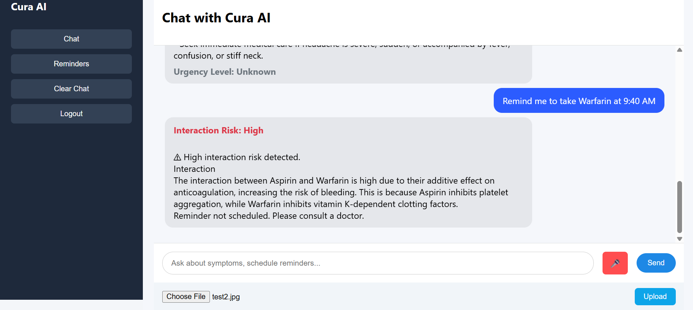

# Cura AI
A Safety-Aware Multi-Agent Healthcare Assistant

---

## 📸 Demo



---

---

## 📌 Overview

The **Cura AI** is a full-stack AI-powered system that integrates multiple intelligent agents to provide:

- Symptom guidance
- Medicine reminder scheduling
- Drug interaction risk analysis
- Medical report analysis from images (OCR-based)
- Layman-friendly health explanations
- Multi-user authentication and persistent memory

The system is designed as a **safety-aware, memory-augmented, multi-agent architecture** suitable for healthcare AI research.

---

## 🏗 System Architecture

The project follows a **Multi-Agent Orchestration Model**.

### Core Agents

1. **Coordinator Agent**
   - Routes user requests based on detected intent.
   - Handles chat, reminders, drug interactions, and report analysis.

2. **Chat Agent**
   - Handles symptom-related and general health queries.
   - Uses contextual memory for personalized responses.

3. **Reminder Agent**
   - Extracts medicine name and time.
   - Performs safety check before scheduling.
   - Uses risk-based gating:
     - Low → Schedule
     - Moderate → Schedule with warning
     - High → Block scheduling

4. **Drug Interaction Agent**
   - Analyzes interactions among stored medicines.
   - Returns risk level (Low / Moderate / High).
   - Ensures safe reminder scheduling.

5. **Report Agent**
   - Uses Tesseract OCR to extract text from medical report images.
   - Converts technical medical reports into layman-friendly summaries.
   - Removes markdown, lab ranges, and technical jargon.
   - Provides simplified health explanation with recommendation.

---

## 🧠 Memory Design

### Persistent Memory (SQLite)
The system stores long-term user data securely using a SQLite database.

Stored entities include:
- **Users** (id, email, hashed password, name)
- **Medicines** (encrypted medicine names associated with a user)
- **Reminders** (scheduled medication reminders)
- **Report Summaries** (AI-generated explanations of uploaded reports)

Sensitive medical information such as medicine names is **encrypted before storage** to protect user privacy.

### Short-Term Context (Session Memory)
Short-term conversation context is maintained in memory during the user session.

This includes:
- Recent chat history
- Current medicines taken by the user

This context allows the system to perform **context-aware reasoning**, such as checking drug interactions or providing more personalized responses.

### Safety Logic
Cura AI includes built-in safety checks before performing actions.

- **Drug interaction verification** is performed before scheduling medication reminders.
- The system analyzes all current medicines and the new medicine being added.
- If a **high-risk interaction** is detected, the reminder is blocked.
- If a **moderate-risk interaction** is detected, the reminder is scheduled with a warning.

These safety mechanisms help reduce the risk of unsafe medication combinations.

---

## 🔐 Authentication & Security

Cura AI implements secure user authentication and data protection mechanisms.

- **Secure Register & Login** system
- Passwords stored using **bcrypt hashing**
- **Multi-user support** with isolated medical data per user
- **Access control verification** for API requests
- **Encrypted storage** for sensitive medical data
- **Session persistence using localStorage** on the frontend

These measures ensure that sensitive healthcare information remains **private, secure, and accessible only to the authenticated user**.

---

## 🩺 Features

- AI-powered symptom explanation
- Medicine tracking
- Reminder scheduling
- Drug interaction detection
- Risk-based execution gating
- OCR-based medical report analysis
- Layman health summary generation
- Persistent user memory
- Modern chat-based UI

---

## 🛠 Tech Stack

### Backend
- Flask
- SQLite
- pytesseract (OCR)
- Groq LLM API
- Custom Multi-Agent Orchestration
- Encryption using Fernet
- Access control
- Hashing using SHA256 to prevent data tempering

### Frontend
- HTML
- CSS
- JavaScript
- Modern chat UI
- Local storage session management

---

## 📂 Project Structure

```
cura-ai/
│
├── backend/
│   │
│   ├── agents/
│   │   ├── coordinator_agent.py      # Routes user intent to appropriate agent
│   │   ├── chat_agent.py             # Handles symptom & health queries
│   │   ├── reminder_agent.py         # Schedules reminders with safety checks
│   │   ├── interaction_agent.py      # Performs drug interaction analysis
│   │   ├── report_agent.py           # Analyzes medical reports via OCR + LLM
│   │   └── symptom_agent.py          # Provides structured symptom guidance
│   │
│   ├── tools/
│   │   ├── report_image_processor.py # Extracts text from report images (Tesseract OCR)
│   │   ├── llm_client.py             # Handles LLM API communication (Groq / Gemini)
│   │   └── rxnorm_tool.py            # Drug information lookup utility
│   │
│   ├── memory/
│   │   ├── memory_manager.py         # Central memory controller
│   │   ├── persistent_memory.py      # Handles long-term storage retrieval
│   │   └── session_memory.py         # Maintains short-term conversation context
│   │
│   ├── database/
│   │   └── db.py                     # SQLite database connection & schema
│   │
│   ├── scheduler/
│   │   ├── email_service.py          # Sends reminder notifications
│   │   └── reminder_scheduler.py     # Background reminder scheduler
│   │
│   ├── utils/
│   │   ├── intent_classifier.py      # Detects user intent
│   │   ├── logger.py                 # Logging utility
│   │   ├── crypto_utils.py           # Encryption / decryption for sensitive data
│   │   └── auth_utils.py             # Access control verification
│   │
│   ├── uploads/                      # Uploaded medical report images
│   │
│   ├── app.py                        # Main Flask application entry point
│   ├── requirements.txt              # Backend dependencies
│   └── .env                          # Environment variables (API keys)
│
├── frontend/
│   │
│   ├── pages/
│   │   ├── login.html                # User authentication page
│   │   └── dashboard.html            # Main chat interface
│   │
│   ├── static/
│   │   ├── css/
│   │   │   └── style.css             # UI styling
│   │   │
│   │   └── js/
│   │       └── script.js             # Frontend logic & API calls
│   │
│   └── (served via http.server)      # Local frontend server
│
├── README.md                         # Project documentation
└── .gitignore                        # Ignored files
```

---

## 🚀 Setup Instructions

### 1️⃣ Clone Repository

git clone https://github.com/rahulkadvasara/cura-ai
cd cura-ai

---

### 2️⃣ Backend Setup

cd backend  

python -m venv venv  
venv\Scripts\activate      # Windows  

pip install -r requirements.txt  

Create a `.env` file inside backend:

GROQ_API_KEY=your_groq_api_key_here  

Run backend:

python app.py  

Backend will start at:  
http://127.0.0.1:5000  

---

### 3️⃣ Frontend Setup

cd frontend  

python -m http.server 5500  

Open in browser:

http://localhost:5500/pages/login.html  

---

## 🔐 Authentication Flow

1. Register with email and password  
2. Password is securely hashed using bcrypt  
3. Login returns user_id  
4. user_id is stored in localStorage  
5. All chat and reminder requests use this user_id  

---

## 🧠 System Workflow

1. User sends message or uploads report  
2. Coordinator Agent detects intent  
3. Request is routed to:
   - ChatAgent
   - ReminderAgent
   - InteractionAgent
   - ReportAgent
4. Persistent memory is retrieved from SQLite  
5. Safety checks performed if needed  
6. Response returned to frontend  

---

## 🩺 Drug Interaction Safety Logic

Before scheduling a reminder:

1. Retrieve stored medicines  
2. Add new medicine to temporary list  
3. Send list to InteractionAgent  
4. Risk classified as:
   - Low → Schedule normally  
   - Moderate → Schedule with warning  
   - High → Block scheduling  
5. Save reminder only if safe  

This ensures conditional execution in healthcare context.

---

## 📷 OCR Configuration

Install Tesseract OCR.

Ensure correct path in:

backend/tools/report_image_processor.py  

Example:

pytesseract.pytesseract.tesseract_cmd = r"D:\Tesseract-OCR\tesseract.exe"

Make sure:
- "Run as administrator" is NOT enabled for tesseract.exe

---

## 📄 Research Focus

This project demonstrates:

- Memory-augmented LLM agents
- Safety-aware healthcare AI
- Conditional execution logic
- Agent orchestration architecture
- Risk classification for medical decisions

---

## 🧪 Future Improvements

- Vector database memory
- PDF report support
- Structured evaluation metrics
- Model comparison experiments
- Role-based healthcare deployment
- Docker containerization

---

## 👨‍💻 Author

Rahul Kumar  
B.Tech CSE (AIML)  
